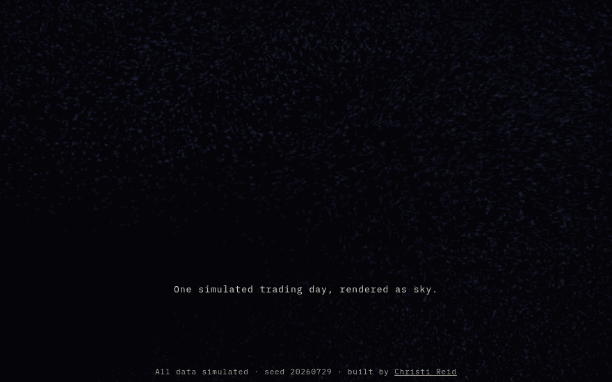
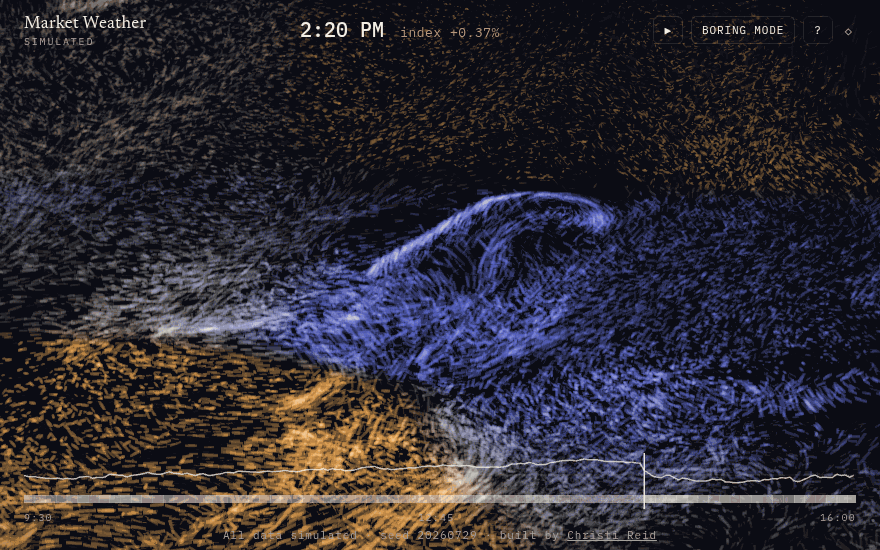
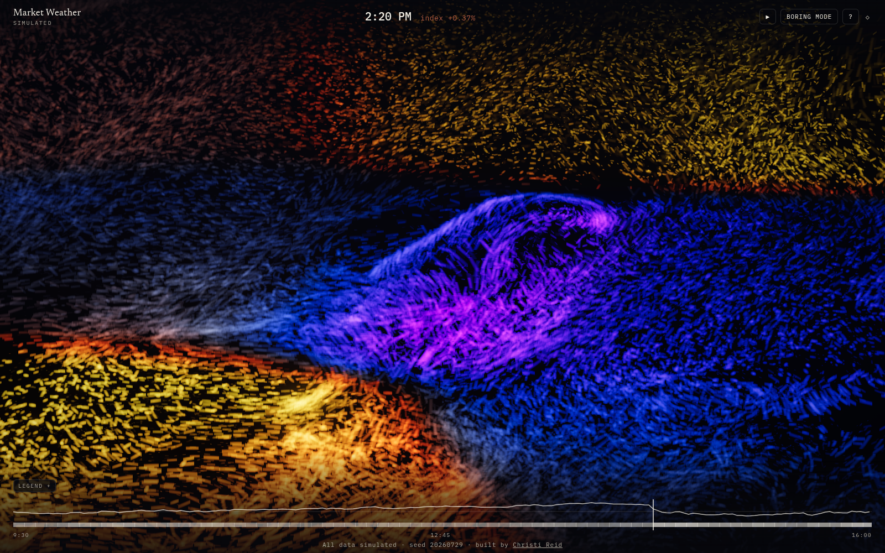
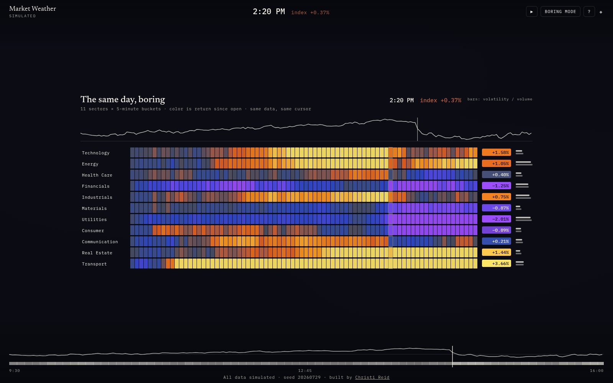
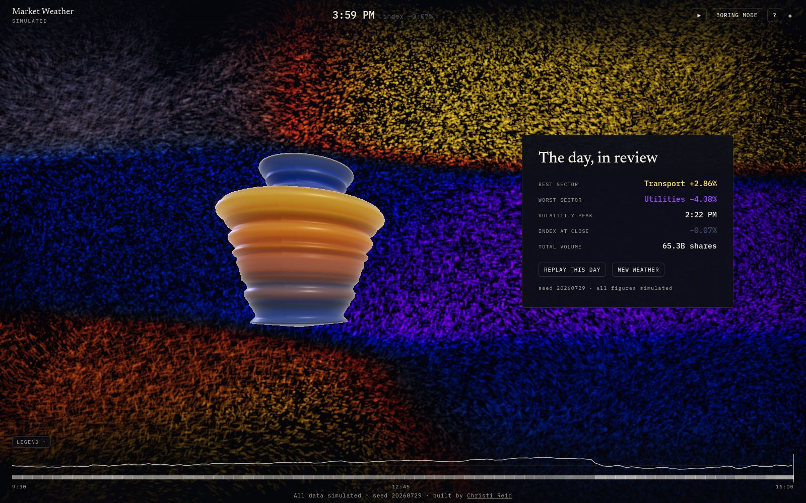

<div align="center">

# ☁︎ MARKET WEATHER

### One simulated trading day, rendered as sky.

*A full-screen WebGL instrument by **Christi Reid** — eleven sectors, correlated returns,*
*volatility that gusts and clusters, all breathing as one living atmosphere.*

<br/>


*<sup>2:20 PM. The macro shock lands: a luminous crest breaks over the front line as four correlated
sectors turn cool and turbulent, while the sectors still rallying burn amber above and below.
Every stroke is a particle drawn along its own wind; every color, every eddy, every void is data.</sup>*

<br/>

**[The title is made of weather](#the-opening)** ·
**[The metaphor contract](#why-weather--the-metaphor-contract)** ·
**[Boring Mode](#boring-mode--the-judgment-statement)** ·
**[Architecture](#architecture)** ·
**[Run it](#run-it)**

</div>

---

## The opening

The particles that will spend the day as atmosphere first condense into the wordmark —
then a gust blows the letters back into the sky, and the trading day begins.
Skippable from the first frame; deep links (`?t=`, `?mode=`) bypass it entirely.



---

## Why weather? — the metaphor contract

Markets already speak in weather: climates, headwinds, storms, calm.
This piece takes the metaphor literally and then signs a contract with it —
**every visual channel maps to exactly one data channel, and nothing else moves:**

| you see | it is | nothing else |
| --- | --- | --- |
| 🜁 wind strokes | sector momentum — every particle is drawn along its own velocity, bright head first: rising sectors stream **up-right**, falling **down-left** | |
| 🌀 turbulence, stroke length | sector volatility — calm air is fine grain; a squall is combed into long ragged filaments | |
| ✦ particle density & size | trading volume — thin morning air, thick panic | |
| 🎨 color temperature | return since open — incandescent **gold** through ember for gains, electric **violet** through azure for losses, and a quiet dark slate at zero, so **only news glows** (deliberately not green/red) | |
| ✧ brief luminance pulses | volume spikes | |

An effect that cannot name its data channel does not ship. The one-day storm you're watching
is seeded simulation — **no real tickers, no real history, every figure labeled simulated** —
with the canonical seed `20260729` pinning its squall to 2:20 PM so the sky always has a story:
calm morning, afternoon break, partial mend into the close.


*<sup>The regime transition, live: anticipation builds through 2:19, the sky breaks at 2:20,
and the squall broods and decays over the following half hour — all driven by a GARCH-flavored
volatility engine whose shock echoes with an eleven-minute half-life.</sup>*

---

## Grab the day and drag it

The scrubber carries the realized index path and a volatility heat strip. Scrubbing doesn't
*seek* — the sky at any minute is deterministically recomputed (`hash(seed, minute)` → 90
warm-up steps) while the displayed particles **glide from where they were into the new
weather**, so it feels like dragging the day itself.


Click any region of the sky and the camera flies in as that sector's particles organize into
a slow vortex; a typeset instrument panel slides in with five fictional constituents and their
sparklines. Escape releases. Every flight is interruptible mid-air.


---

## Boring Mode — the judgment statement

Press **B** and the spectacle *becomes* the chart: the atmosphere files into eleven rows of
5-minute buckets, then hands over to a DOM/SVG heatmap of the very same data through the very
same store selectors — same ramp, same cursor, same focus interaction, plus per-row
volatility/volume micro-bars so **information parity is checkable, and checked** (it's a
logged gate in this repo, not a slogan).



*<sup>The argument in one toggle: knowing the difference between data art and data reading —
and building both. Boring Mode doubles as the screen-reader surface and the no-WebGL fallback.</sup>*

| The field | The same day, boring |
| --- | --- |
|  |  |

---

## The day ends — and is turned

At 4:00 PM the field stills, and the day condenses into a **vessel turned from its own chart**:
the index path revolved on a lathe — the 2:20 drawdown is a literal choke in the silhouette,
the recovery flares the lip, and the bands are glazed by each minute's return. Stormy days turn
rougher, harder-smoldering vessels. **Replay** runs the same seed; **new weather** turns a new
one — every day shareable by URL (`?seed=`).



---

## Architecture

```
                    ┌───────────────────────────────┐
                    │   packages/market  (pure TS)  │
                    │  mulberry32 · GARCH vol · 66  │
                    │  tests · canonical day pinned │
                    └──────────────┬────────────────┘
                                   │  MarketDay (immutable)
                    ┌──────────────▼────────────────┐
                    │        one zustand store      │
                    │   seed · minute · mode · focus│
                    │   (state ⇄ URL, all of it)    │
                    └───────┬───────────────┬───────┘
              same selectors│               │same selectors
        ┌───────────────────▼───┐   ┌───────▼──────────────────┐
        │   R3F scene (WebGL)   │   │   DOM layer              │
        │ air texture → sim FBO │   │ HUD · scrubber · panel   │
        │ ping-pong → 200k pts  │   │ Boring Mode heatmap      │
        │ bloom·ACES·grain·vig  │   │ (a11y + no-WebGL surface)│
        └───────────────────────┘   └──────────────────────────┘
```

**The shader pipeline, in one breath:** each frame, the engine's per-sector channels
(momentum / volatility / volume / temperature) are Gaussian-blended over the eleven
Voronoi sky-regions and baked into a 64×64 **air texture** on the CPU — one bilinear fetch
replaces an 11-site loop in every shader. The **simulation pass** (FBO ping-pong, 448²≈200k
particles high tier / 245²≈60k low) advects positions through wind (momentum) plus
divergence-free curl noise whose *energy* — not frequency — comes from volatility, so storms
tear harder while the currents stay coherent enough to read at composition scale. The
**render pass** draws each particle as a **wind stroke**: a capsule stretched along its own
velocity, length growing with local speed, comet-shaded so the bright head shows which way
the sector is moving even in a paused frame — calm air is fine grain, a squall is combed into
long ragged filaments. Size and gate come from volume, color from a seven-stop OKLab
temperature ramp whose luminance is **V-shaped** — flat sectors sink into the night while the
day's movers carry all the light. Because additive blending bleaches dense regions toward
white, the shader boosts saturation and glow by each particle's *distance from neutral*, so the
biggest movers burn hardest **in their own hue** instead of washing out. All under a strict
post budget: bloom, ACES, fine grain, vignette. Scrubs re-seed positions from
`hash(seed, minute)` and warm up 90 fixed steps, so minute *t* is the same sky no matter how
you got there. The whole day runs on one injected virtual clock — no wall-clock reads
anywhere a capture could see.

**Determinism is the test harness:** every state is a URL, every capture steps the clock via
`window.__mw`, and the look-dev/motion/a11y/perf loops in `docs/` judge screenshots and
contact sheets, never code.

### The quality-tier system

| tier | particles | post | when |
| --- | --- | --- | --- |
| ◆ high | 200k (448²) | full chain | default; hardware GPUs |
| ◇ low | 60k (245²) | full chain | adaptive step-down (p75 > 25ms for 2s) |
| ◇ floor | 7.7k + DPR 0.28 + post off | — | software rasterizers, live only |

The controller measures rolling frame time, steps down through particle count → DPR →
post-processing, recovers after 10 stable seconds, and shows its state in the HUD (◆/◇).
`?tier=high|low` pins a tier for reproducible captures and perf runs.

---

## Accessible by argument, not by afterthought

- The canvas is `role="img"` with a per-minute label; **input never touches it** — eleven
  invisible focusable region buttons, a slider scrubber, and global shortcuts carry everything.
- A polite aria-live region narrates regime changes from the same generator as the canvas label:
  *"2:20 PM — volatility spike. Energy, Financials, Industrials and Utilities are stormy."*
- **Boring Mode is the parity surface** — the documented screen-reader path, with computed
  per-cell contrast (WCAG math, not eyeballs — see D-010 for the case both inks fail).
- `prefers-reduced-motion`: nothing moves on its own. Time is stepped, stills are recomputed,
  the title is a card, even the film grain is dropped so a still frame is byte-stable.
- No WebGL? You get the same day as the readable chart, plus one explanatory line.

Verified in CI: axe (0 critical/serious across four states), a scripted keyboard walk,
byte-identical reduced-motion frames, a deuteranopia capture (the amber/violet ramp lands on
the CVD-safe yellow/blue axis, and every figure is signed anyway).

---

## Run it

```bash
pnpm install
pnpm dev          # → apps/weather on Vite's dev server
pnpm test         # 66 engine tests
pnpm archetypes   # classify seeds 1–200 (flat / calm-drift / one-storm / choppy)
pnpm build        # static build → apps/weather/dist  (deploy anywhere static)
pnpm smoke        # headless SwiftShader: non-black canvas + a still per state
pnpm capture      # look-dev stills   ·  node scripts/motion.mjs  → contact sheets
node scripts/a11y.mjs   # axe + keyboard walk + reduced-motion + fallback
node scripts/perf.mjs   # frame trace + adaptive demo + entity audit + load budget
```

Deploy: it's a static folder. `npx serve apps/weather/dist` or any static host.

### Keyboard

| key | does |
| --- | --- |
| `Tab` | skip link → HUD → scrubber → sky regions → footer |
| `←` `→` | scrubber: ±5 simulated minutes (`Shift`: ±30) · `Home`/`End` jump |
| `Enter` / `Esc` | focus a sector / release |
| `Space` | pause · resume |
| `B` | Boring Mode |
| `R` | replay the day |
| `?` | shortcut sheet |

### URL grammar

```
?seed=8675309        a different day (shareable)
&t=290               jump to minute 290 (2:20 PM)
&mode=boring         straight to the chart
&focus=technology    open a sector panel
&tier=high|low       pin the quality tier
```

---

<div align="center">

**All data simulated.** No real tickers, no real days, no market claims — just weather.

Engine: 66 deterministic tests · Loops: 4 logged critique cycles · Docs: 5 ADRs + 4 loop logs

MIT · built by Christi Reid · seed `20260729`

</div>
